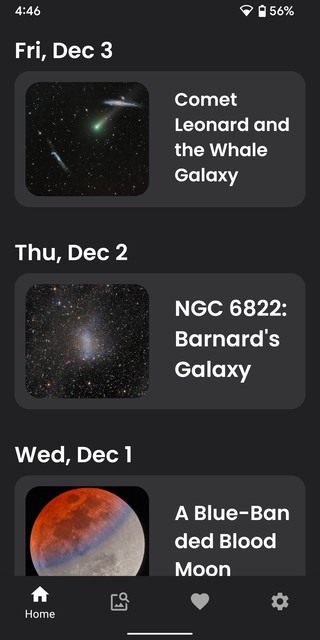
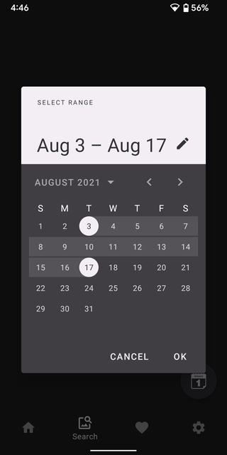
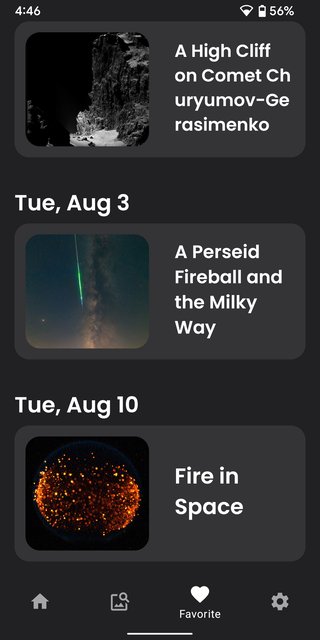
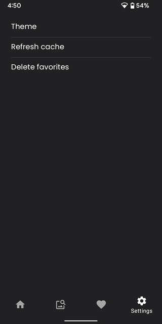
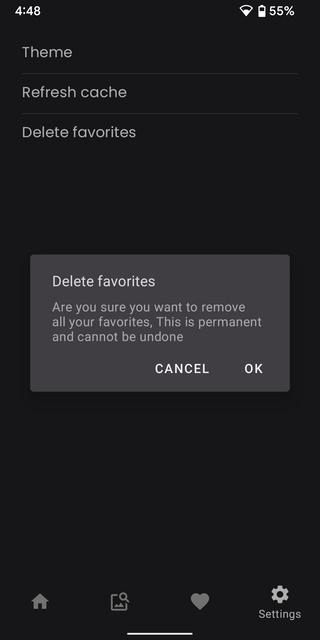

# Astronomy Pictures

Discover the cosmos! Each day a different image or photograph of our fascinating universe is featured, along with a brief explanation written by a professional astronomer.

* Clean Architecture With **MVVM**

* [Astronomy Picture of the Day](https://apod.nasa.gov/apod/archivepix.html) - the source of every displayed image.

* [Retrofit](https://square.github.io/retrofit/) - used for networking.

* [Glide](https://github.com/bumptech/glide) - used for image loading.

* [Photoview](https://github.com/Baseflow/PhotoView) - a custom imageview with pinch zoom funtionality.

* [Material Components](https://material.io/components/) - used for creating user interface.

* [Room](https://developer.android.com/jetpack/androidx/releases/room) - used for caching images and storing data.

* [DataStore](https://developer.android.com/topic/libraries/architecture/datastore) - used for storing user preferences.

## Screenshots

  
 
